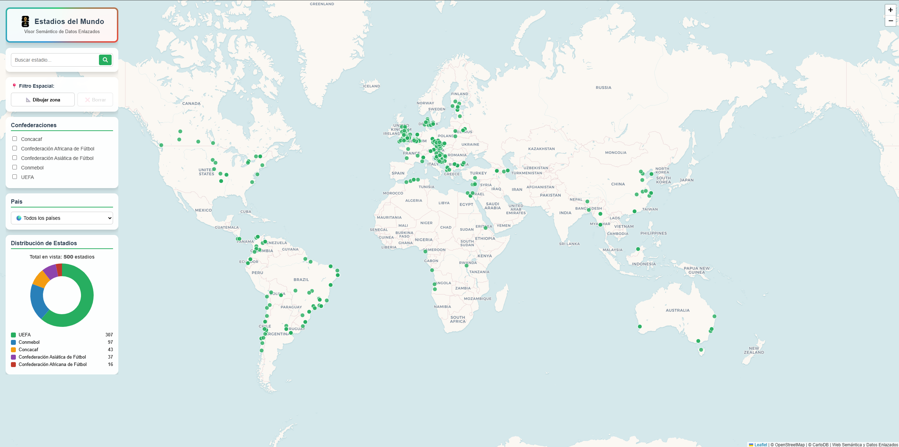
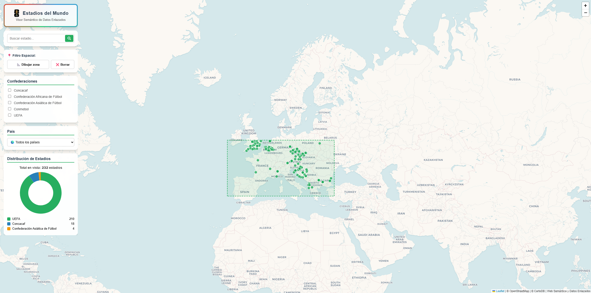
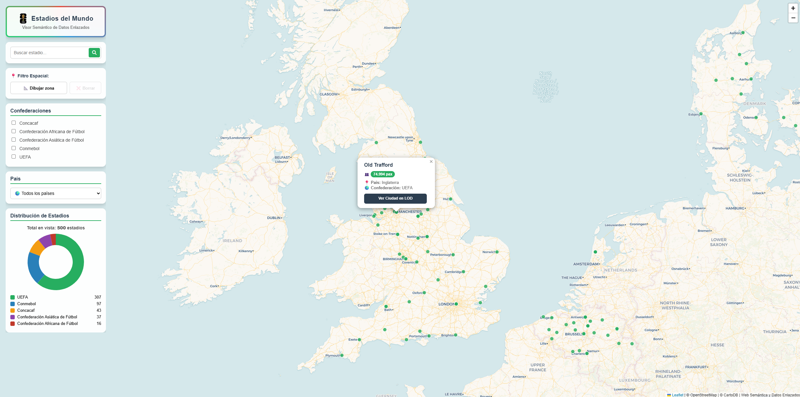

# Memoria Justificativa: Visor Semántico de Estadios de Fútbol del Mundo

**Autor:** Marcos Moreda Blanco  
**Asignatura:** Web Semántica y Datos Enlazados  
**Máster:** Máster Universitario en Investigación en Inteligencia Artificial  
**Institución:** Universidad Internacional Menéndez Pelayo (UIMP)  

---

## Índice
1. [Introducción](#1-introducción)
2. [Proceso de transformación](#2-proceso-de-transformación)
    * [a. Selección de la fuente de datos](#a-selección-de-la-fuente-de-datos)
    * [b. Análisis de los datos](#b-análisis-de-los-datos)
    * [c. Estrategia de nombrado](#c-estrategia-de-nombrado)
    * [d. Desarrollo del vocabulario](#d-desarrollo-del-vocabulario)
    * [e. Proceso de transformación](#e-proceso-de-transformación)
    * [f. Enlazado](#f-enlazado)
    * [g. Publicación](#g-publicación)
3. [Aplicación y explotación](#3-aplicación-y-explotación)
4. [Conclusiones](#4-conclusiones)
5. [Bibliografía](#5-bibliografía)

---

## 1. Introducción

El presente proyecto documenta el proceso íntegro de transformación de un conjunto de datos sobre recintos deportivos (Estadios de Fútbol del Mundo) hacia un formato de Grafo de Conocimiento (*Knowledge Graph*). El objetivo principal es aplicar el ciclo de vida de generación de *Linked Data*, elevando el nivel de madurez de un conjunto de datos plano y aislado, e interconectándolo con la nube global de datos (*LOD Cloud*) mediante tecnologías estandarizadas por el W3C (RDF, OWL y SPARQL).

Para demostrar la utilidad real de estos datos integrados, se ha desarrollado una aplicación web del lado del cliente interactiva. Esta aplicación realiza consultas federadas en tiempo real contra un servidor semántico local (**Apache Jena Fuseki**) y el endpoint público de **Wikidata**, combinando información local (capacidades y ligas) con coordenadas geográficas y traducciones dinámicas extraídas de la Web Semántica.

### Estructura del Repositorio y Trazabilidad

Desde un punto de vista metodológico, el proyecto exige que el proceso sea auditable y reproducible. Por ello, el repositorio se ha organizado separando estrictamente los datos de origen, la lógica de transformación, el modelo conceptual, el resultado semántico y su capa de explotación:

```text
Marcos_Moreda_Blanco/
├── README.md                      <-- Memoria técnica detallada del proyecto
├── app/                           <-- Aplicación web cliente para la explotación de los datos
│   ├── index.html                 
│   ├── styles.css                 
│   ├── app.js                     
│   └── fifa26.png                 <-- Recursos gráficos de la interfaz
├── data/
│   └── estadios_mundo.csv         <-- Fuente de datos original tabular (Raw data)
├── images/
│   ├── VistaGeneral.png           <-- Evidencia del mapa global y gráficas
│   ├── FiltroEspacial.png         <-- Evidencia del filtro espacial
│   ├── PopupEstadio.png           <-- Evidencia del filtrado y enlace a LOD
│   └── ...                        <-- Resto de imágenes
├── metadata/
│   └── metadata.ttl               <-- Archivo con metadatos del dataset (VoID/DCAT)
├── ontology/
│   └── ontology.ttl               <-- Vocabulario ontológico del dominio (OWL/Turtle)
├── rdf/
│   └── estadios_mundo.ttl         <-- Grafo de conocimiento final serializado en Turtle
└── transform/
    ├── cleaning_operations.json   <-- Historial de operaciones GREL para la limpieza de datos
    └── mapping_template.json      <-- Plantilla de configuración del esqueleto RDF en OpenRefine
```

Esta arquitectura asegura que cada fase explicada en esta memoria esté respaldada por una evidencia técnica concreta, permitiendo la trazabilidad completa desde la celda original del CSV hasta la tripleta RDF consultada en el visor web.

---

## 2. Proceso de transformación

### a. Selección de la fuente de datos
La fuente de datos primaria consiste en un dataset plano en formato CSV que contiene un inventario global de estadios de fútbol. Se trata de un conjunto de datos idóneo para un ejercicio de Web Semántica porque presenta una estructura rica en dimensiones internacionales. Al incluir ciudades, países y confederaciones, abre la posibilidad de modelar jerarquías y, sobre todo, facilita la conexión con recursos externos globales, cumpliendo así con el principio fundamental de los Datos Enlazados.

### b. Análisis de los datos
El conjunto de datos original gestiona información estructurada no normalizada. La tabla siguiente resume los campos principales utilizados en la transformación:

| Campo original | Tipo de dato | Descripción en el modelo semántico |
| :--- | :--- | :--- |
| `nombre_estadio` | String | Identificador y nombre oficial del recinto deportivo. |
| `capacidad` | Integer | Aforo máximo de espectadores. |
| `ciudad` | String | Localidad donde se ubica la infraestructura. |
| `pais` | String | Estado soberano al que pertenece. |
| `confederacion` | String | Entidad supranacional de fútbol (UEFA, CONMEBOL, CAF...). |

**Análisis de licencias**
Los datos de origen provienen de fuentes de acceso abierto bajo condiciones de uso público. Para el Grafo de Conocimiento resultante, se ha optado por aplicar una licencia **Creative Commons Attribution 4.0 International (CC-BY 4.0)**. Esta decisión busca fomentar la máxima reutilización de los datos semánticos dentro de la iniciativa *Open Data*, permitiendo a terceros construir nuevas aplicaciones a partir de este trabajo.

### c. Estrategia de nombrado
Para garantizar la estabilidad de los identificadores y mantener una separación clara entre el esquema ontológico y las instancias de los datos, se ha adoptado una estrategia de nombrado basada en dos espacios diferenciados:

1. **Espacio del vocabulario (Hash URIs):** `fut: <http://futbol.linkeddata.es/ontology#>`
2. **Espacio de recursos (Slash URIs):** `http://futbol.linkeddata.es/resource/`

La decisión de utilizar **Hash URIs (`#`)** para el vocabulario responde a un criterio de eficiencia, ya que el esquema es reducido y se recupera como un único documento. Para las instancias se emplean **Slash URIs (`/`)**, favoreciendo la extensibilidad del dataset (ej. `http://futbol.linkeddata.es/resource/Estadio_Santiago_Bernabeu`). Para conceptos genéricos, se ha reutilizado el esquema estándar `schema: <http://schema.org/>`.

### d. Desarrollo del vocabulario
Se ha implementado un vocabulario semántico ligero que combina términos propios del dominio deportivo con la reutilización de ontologías consolidadas para garantizar la interoperabilidad.

**Clases principales:**
* `fut:Estadio`: Representa el recinto deportivo (subclase o equivalente a `schema:Stadium`).

**Propiedades de Objeto (Object Properties):**
* `fut:ubicadoEnCiudad`: Conecta el estadio con el recurso de su ciudad.
* `schema:addressCountry`: Conecta el estadio con el recurso semántico del país.
* `fut:perteneceAConfederacion`: Relaciona el estadio con su confederación continental.

**Propiedades de Datos (Datatype Properties):**
* `schema:name`: Nombre oficial del estadio (`xsd:string`).
* `fut:capacidadTotal`: Aforo de espectadores (`xsd:integer`).

### e. Proceso de transformación
La limpieza, normalización y transformación a RDF se llevó a cabo utilizando **OpenRefine** complementado con la extensión **RDF Transform**. 

Para aportar reproducibilidad al proceso, se han almacenado en el directorio `transform/` dos artefactos fundamentales:
1. `cleaning_operations.json`: Registra el historial de operaciones de limpieza, incluyendo recortes de texto (*trim*) y la conversión de los tipos numéricos para asegurar que la capacidad se exportara como `xsd:integer`.
2. `mapping_template.json`: Contiene la configuración visual del esqueleto RDF, mapeando las columnas del CSV a las propiedades definidas en la ontología. 

El resultado de esta transformación se materializó y exportó en formato **Turtle (.ttl)**, alojado en el directorio `rdf/`.

### f. Enlazado
La riqueza del grafo radica en su interconexión externa. En lugar de almacenar cadenas de texto estáticas para las ciudades, países y confederaciones, se realizó un proceso de **reconciliación** semántica contra **Wikidata** desde OpenRefine.

Se asoció cada registro con su entidad correspondiente (ej. *UEFA* reconciliado con `wd:Q35572`). Una vez reconciliados, se generó la URI del recurso enlazado utilizando lenguaje **GREL**:
```grel
"[https://www.wikidata.org/entity/](https://www.wikidata.org/entity/)" + cell.recon.match.id
```
Esta decisión arquitectónica permite delegar en Wikidata la recuperación de datos geográficos y el soporte multilingüe, conectando directamente nuestro nodo local con la LOD Cloud.

### g. Publicación
Los datos generados han sido publicados localmente utilizando **Apache Jena Fuseki**, empleando el motor de persistencia *TDB2* para indexar el grafo de forma eficiente.
* **Puerto de servicio:** `3030`
* **Dataset Name:** `estadios`
* **Endpoint SPARQL:** `http://localhost:3030/estadios/query`

**Publicación de Metadatos:**
Como buena práctica en la Web Semántica, la publicación se acompaña de metadatos descriptivos. En el directorio `metadata/` se incluye el archivo `metadata.ttl`, implementado utilizando vocabularios como **VoID** y **DCAT**, lo que documenta de forma legible para máquinas la autoría, licencia y características del dataset.

---

## 3. Aplicación y explotación

Para materializar el consumo de este Grafo de Conocimiento, se ha desarrollado una aplicación web cliente (HTML/CSS/JS Vanilla) disponible en el directorio `app/`. Esta interfaz actúa como capa de explotación visual y analítica, conectándose de forma asíncrona mediante **consultas federadas**.

### Funcionalidades de la Aplicación
1. **Vista General de la Aplicación:** Representación geográfica inicial de los estadios (se ha aplicado una paginación asíncrona y límites en las peticiones para garantizar la fluidez de la interfaz y respetar las cuotas del *endpoint* de Wikidata).
2. **Filtro Espacial:** Permite al usuario dibujar un área rectangular (Bounding Box) sobre el mapa con *Leaflet* para filtrar los recintos en tiempo real.
3. **Filtros Dinámicos e Interfaz:** Menús desplegables integrados para filtrar por Confederación y País. La interfaz incluye una cabecera temática con un efecto luminoso LED animado desarrollado íntegramente en CSS mediante gradientes cónicos rotatorios.
4. **Distribución Visual:** Integración con *Chart.js* para renderizar gráficas de tarta actualizadas dinámicamente según los filtros activos.

### La Consulta SPARQL Federada (Demostración de Viabilidad)
La pieza de ingeniería clave es la consulta SPARQL federada. Se lanza al endpoint local de Fuseki, pero realiza una llamada externa (`SERVICE`) a Wikidata para resolver en tiempo real las coordenadas geográficas y traducir las etiquetas al español:

```sparql
PREFIX fut: [http://futbol.linkeddata.es/ontology#](http://futbol.linkeddata.es/ontology#)
PREFIX schema: [http://schema.org/](http://schema.org/)
PREFIX wdt: [http://www.wikidata.org/prop/direct/](http://www.wikidata.org/prop/direct/)
PREFIX rdfs: [http://www.w3.org/2000/01/rdf-schema#](http://www.w3.org/2000/01/rdf-schema#)

SELECT ?nombre ?capacidad ?ciudadURI ?confederacionNombre ?paisNombre ?coords
WHERE {
  ?estadio a fut:Estadio ;
           schema:name ?nombre ;
           fut:capacidadTotal ?capacidad ;
           fut:ubicadoEnCiudad ?ciudadURI ;
           schema:addressCountry ?paisURI ;
           fut:perteneceAConfederacion ?confederacionURI .

  # Extracción de coordenadas y traducciones desde Wikidata al vuelo
  SERVICE [https://query.wikidata.org/sparql](https://query.wikidata.org/sparql) {
      ?ciudadURI wdt:P625 ?coords .
      ?confederacionURI rdfs:label ?confederacionNombre .
      ?paisURI rdfs:label ?paisNombre .
      FILTER(LANG(?confederacionNombre) = "es")
      FILTER(LANG(?paisNombre) = "es")
  }
}
```

### Capturas de Pantalla de la Aplicación
Las evidencias visuales del funcionamiento de esta aplicación certifican su viabilidad operativa:

* **Vista General y Estadísticas:** 
* **Filtrado por Zona Dibujada:** 
* **Popup de Detalles y Enlace a LOD:** 

---

## 4. Conclusiones

Este proyecto ha permitido afianzar de manera práctica los conceptos de modelado semántico y publicación de datos enlazados. El mayor logro técnico del visor desarrollado ha sido demostrar la viabilidad de enlazar fuentes de datos heterogéneas. A través de **consultas federadas en SPARQL dirigidas a Wikidata**, el sistema interroga a la web semántica en tiempo real para recuperar las coordenadas geoespaciales y las etiquetas idiomáticas, cruzándolas al vuelo con la base de datos local.

La principal conclusión técnica es la tremenda potencia que ofrece la **federación**. Al conectar nuestros datos de negocio (la capacidad de los estadios) con Wikidata, evitamos construir y mantener diccionarios geográficos de forma local. Sin embargo, la implementación práctica también ha revelado los desafíos del *rate limiting*; depender exclusivamente de llamadas federadas masivas introduce problemas de rendimiento en la capa cliente debido a las restricciones de los servidores públicos.

### Líneas de trabajo futuro
Para futuras iteraciones o para llevar esta solución a un entorno de producción real, la estrategia óptima consistiría en la **materialización periódica** de los datos externos. Es decir, ejecutar la consulta federada durante la fase ETL, cacheando las coordenadas e idiomas directamente en el triplestore local (Fuseki). Esto permitiría combinar la inmensa riqueza de la *LOD Cloud* con una experiencia de usuario instantánea, robusta y tolerante a fallos de red.

---

## 5. Bibliografía

**Fuentes de Datos y Conocimiento**
* **Wikidata.** *Base de conocimiento libre y colaborativa*. Utilizada para el servicio de reconciliación espacial y traducción. Recuperado de: [https://www.wikidata.org](https://www.wikidata.org)

**Estándares y Vocabularios (W3C)**
* **W3C (2014).** *RDF 1.1 Concepts and Abstract Syntax*. Recuperado de: [https://www.w3.org/TR/rdf11-concepts/](https://www.w3.org/TR/rdf11-concepts/)
* **W3C (2013).** *SPARQL 1.1 Query Language*. Recuperado de: [https://www.w3.org/TR/sparql11-query/](https://www.w3.org/TR/sparql11-query/)
* **W3C (2014).** *Data Catalog Vocabulary (DCAT)*. Recuperado de: [https://www.w3.org/TR/vocab-dcat/](https://www.w3.org/TR/vocab-dcat/)
* **W3C (2011).** *Describing Linked Datasets with the VoID Vocabulary*. Recuperado de: [https://www.w3.org/TR/void/](https://www.w3.org/TR/void/)
* **Schema Vocabulary:** *Stadium Concept*. Recuperado de: [https://schema.org/Stadium](https://schema.org/Stadium)

**Herramientas y Librerías**
* **Apache Software Foundation.** *Apache Jena Fuseki*. Servidor Triplestore y endpoint SPARQL. Recuperado de: [https://jena.apache.org/documentation/fuseki2/](https://jena.apache.org/documentation/fuseki2/)
* **OpenRefine & RDF Transform.** Herramienta de limpieza y extensión de exportación.
* **Leaflet JS & Chart.js.** Librerías para visualización de mapas y gráficos.

**Referencias Académicas**
* Material docente y guías prácticas de la asignatura *"Web Semántica y Datos Enlazados"* de la Universidad Internacional Menéndez Pelayo (UIMP).